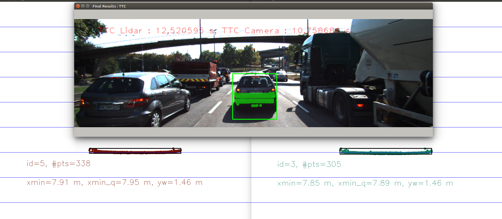
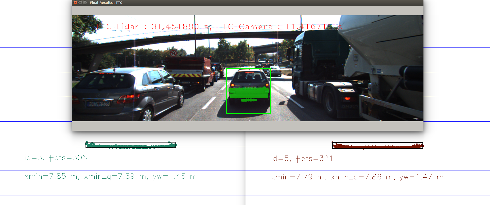
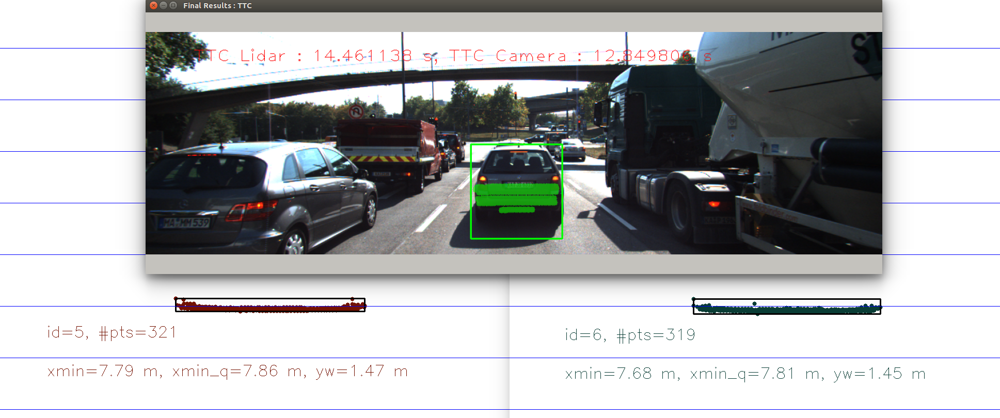
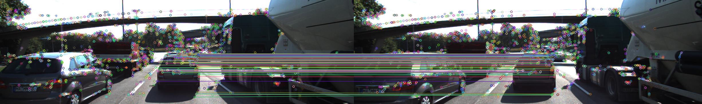
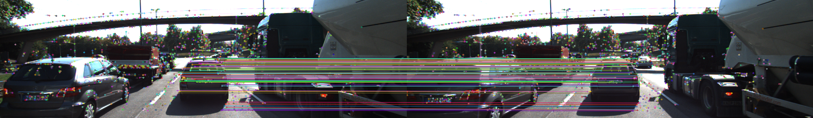

# SFND 3D Object Tracking

Welcome to the final project of the camera course. By completing all the lessons, you now have a solid understanding of keypoint detectors, descriptors, and methods to match them between successive images. Also, you know how to detect objects in an image using the YOLO deep-learning framework. And finally, you know how to associate regions in a camera image with Lidar points in 3D space. Let's take a look at our program schematic to see what we already have accomplished and what's still missing.


In this final project, you will implement the missing parts in the schematic. To do this, you will complete four major tasks: 
1. First, you will develop a way to match 3D objects over time by using keypoint correspondences. 
2. Second, you will compute the TTC based on Lidar measurements. 
3. You will then proceed to do the same using the camera, which requires to first associate keypoint matches to regions of interest and then to compute the TTC based on those matches. 
4. And lastly, you will conduct various tests with the framework. Your goal is to identify the most suitable detector/descriptor combination for TTC estimation and also to search for problems that can lead to faulty measurements by the camera or Lidar sensor. In the last course of this Nanodegree, you will learn about the Kalman filter, which is a great way to combine the two independent TTC measurements into an improved version which is much more reliable than a single sensor alone can be. But before we think about such things, let us focus on your final project in the camera course. 

## Dependencies for Running Locally
* cmake >= 2.8
  * All OSes: [click here for installation instructions](https://cmake.org/install/)
* make >= 4.1 (Linux, Mac), 3.81 (Windows)
  * Linux: make is installed by default on most Linux distros
  * Mac: [install Xcode command line tools to get make](https://developer.apple.com/xcode/features/)
  * Windows: [Click here for installation instructions](http://gnuwin32.sourceforge.net/packages/make.htm)
* Git LFS
  * Weight files are handled using [LFS](https://git-lfs.github.com/)
* OpenCV >= 4.1
  * This must be compiled from source using the `-D OPENCV_ENABLE_NONFREE=ON` cmake flag for testing the SIFT and SURF detectors.
  * The OpenCV 4.1.0 source code can be found [here](https://github.com/opencv/opencv/tree/4.1.0)
* gcc/g++ >= 5.4
  * Linux: gcc / g++ is installed by default on most Linux distros
  * Mac: same deal as make - [install Xcode command line tools](https://developer.apple.com/xcode/features/)
  * Windows: recommend using [MinGW](http://www.mingw.org/)

## Basic Build Instructions

1. Clone this repo.
2. Make a build directory in the top level project directory: `mkdir build && cd build`
3. Compile: `cmake .. && make`
4. Run it: `./3D_object_tracking`.

## Rubric

### 1. Match 3D Objects

**Criteria:**
Implement the method "matchBoundingBoxes", which takes as input both the previous and the current data frames and provides as output the ids of the matched regions of interest (i.e. the boxID property). Matches must be the ones with the highest number of keypoint correspondences.

**Solution:**
Construct `prev_curr_box_score` which records the frequency / score of box-box pair. Iterate matched key points. If the matched points belong to the bounding box pair, then the corresponding box-box pair score increse by one. Last, for each quiry box, select the train box id which has the biggest score.

```c++
void matchBoundingBoxes(std::vector<cv::DMatch> &matches, std::map<int, int> &bbBestMatches, DataFrame &prevFrame, DataFrame &currFrame)
{

    int prev_box_size = prevFrame.boundingBoxes.size();
    int curr_box_size = currFrame.boundingBoxes.size();
    int prev_curr_box_score[prev_box_size][curr_box_size] = {};

    // iterate pnt matchs, cnt box-box match score
    for (auto it = matches.begin(); it != matches.end() - 1; it++)
    {
        // prev pnt
        cv::KeyPoint prev_key_pnt = prevFrame.keypoints[it->queryIdx];
        cv::Point prev_pnt = cv::Point(prev_key_pnt.pt.x, prev_key_pnt.pt.y);

        // curr pnt
        cv::KeyPoint curr_key_pnt = currFrame.keypoints[it->trainIdx];
        cv::Point curr_pnt = cv::Point(curr_key_pnt.pt.x, curr_key_pnt.pt.y);

        // get corresponding box with the point
        std::vector<int> prev_box_id_list, curr_box_id_list;
        for (int i = 0; i < prev_box_size; ++i)
        {
            if (prevFrame.boundingBoxes[i].roi.contains(prev_pnt))
            {
                prev_box_id_list.push_back(i);
            }
        }
        for (int j = 0; j < curr_box_size; ++j)
        {
            if (currFrame.boundingBoxes[j].roi.contains(curr_pnt))
            {
                curr_box_id_list.push_back(j);
            }
        }

        // add cnt to prev_curr_box_score
        for (int i: prev_box_id_list)
        {
            for (int j: curr_box_id_list)
            {
                prev_curr_box_score[i][j] += 1;
            }
        }
    } // END OF THE PNT MATCH

    // for each box in prevFrame, find the box with highest score in currFrame
    for (int i = 0; i < prev_box_size; ++i) 
    {
        int max_score = 0;
        int best_idx = 0;
        
        for (int j = 0; j < curr_box_size; ++j)
        {
            if (prev_curr_box_score[i][j] > max_score)
            {
                max_score = prev_curr_box_score[i][j];
                best_idx = j;
            }
        }

        bbBestMatches[i] = best_idx;
    }
}
```

### 2. Compute Lidar-based TTC

**Criteria:**
Compute the time-to-collision in second for all matched 3D objects using only Lidar measurements from the matched bounding boxes between current and previous frame.

**Solution:**
In order to deal with the outlier points, only select lidar points within ego lane, then use 10% quantile to get stable distance estimation. Finally, use distance estimation to calculate ttc.

ttc = d1 * t / (d0 - d1)

```c++
void computeTTCLidar(std::vector<LidarPoint> &lidarPointsPrev,
                     std::vector<LidarPoint> &lidarPointsCurr, double frameRate, double &TTC)
{
    // auxiliary variables
    double dT = 1.0 / frameRate; // time between two measurements in seconds

    // find closest distance to Lidar points 
    double minXPrev = 1e9, minXCurr = 1e9;

    vector<double> prev_vector;
    for(auto it=lidarPointsPrev.begin(); it!=lidarPointsPrev.end(); ++it) {
        prev_vector.push_back(it->x);
    }
    sort(prev_vector.begin(), prev_vector.end());
    minXPrev = prev_vector[prev_vector.size() * 1 / 5];

    vector<double> curr_vector;
    for(auto it=lidarPointsCurr.begin(); it!=lidarPointsCurr.end(); ++it) {
        curr_vector.push_back(it->x);
    }
    sort(curr_vector.begin(), curr_vector.end());
    minXCurr = curr_vector[curr_vector.size() * 1 / 5];

    // compute TTC from both measurements
    TTC = minXCurr * dT / (minXPrev-minXCurr);

    cout << "lidar ttc cal------------------" << endl;
    cout << "minXPrev: " << minXPrev << endl;
    cout << "minXCurr: " << minXCurr << endl;
    cout << "-------------------------------" << endl;

}
```

### 3. Associate Keypoint Correspondences with Bounding Boxes

**Criteria:**
Prepare the TTC computation based on camera measurements by associating keypoint correspondences to the bounding boxes which enclose them. All matches which satisfy this condition must be added to a vector in the respective bounding box.

**Solution:**
First filter key point matches according to the distance to mean match distance. Then associate a given bounding box with the keypoints it contains and the corresponding matches.

```c++
// associate a given bounding box with the keypoints it contains
void clusterKptMatchesWithROI(BoundingBox &boundingBox, std::vector<cv::KeyPoint> &kptsPrev, std::vector<cv::KeyPoint> &kptsCurr, std::vector<cv::DMatch> &kptMatches)
{
    // calculate mean point match distance in this bbox
    double distance_mean = 0.0;
    double size = 0.0;
    for (auto it = kptMatches.begin(); it != kptMatches.end(); ++it)
    {
        cv::KeyPoint curr_pnt = kptsCurr[it->trainIdx];
        cv::KeyPoint prev_pnt = kptsPrev[it->queryIdx];

        if (boundingBox.roi.contains(curr_pnt.pt))
        {
            distance_mean += cv::norm(curr_pnt.pt - prev_pnt.pt);
            size += 1;
        }
    }
    distance_mean = distance_mean / size;

    // filter point match based on point match distance
    for (auto it = kptMatches.begin(); it != kptMatches.end(); ++it)
    {
        cv::KeyPoint curr_pnt = kptsCurr[it->trainIdx];
        cv::KeyPoint prev_pnt = kptsPrev[it->queryIdx];

        if (boundingBox.roi.contains(curr_pnt.pt))
        {
            double curr_dist = cv::norm(curr_pnt.pt - prev_pnt.pt);

            if (curr_dist < distance_mean * 1.3)
            {
                boundingBox.keypoints.push_back(curr_pnt);
                boundingBox.kptMatches.push_back(*it);
            }
        }
    }
}
```

### 4. Compute Camera-based TTC

**Criteria:**
Compute the time-to-collision in second for all matched 3D objects using only keypoint correspondences from the matched bounding boxes between current and previous frame.

**Solution:**
Calculate the distance change from previous key point pairs to current matched key point pairs. The use the formula below to get the camera based ttc.

ttc = -t / (1-d1/d0)

```c++
// Compute time-to-collision (TTC) based on keypoint correspondences in successive images
void computeTTCCamera(std::vector<cv::KeyPoint> &kptsPrev, std::vector<cv::KeyPoint> &kptsCurr,
                      std::vector<cv::DMatch> kptMatches, double frameRate, double &TTC, cv::Mat *visImg)
{
    // compute distance ratios between all matched keypoints
    vector<double> distRatios; // stores the distance ratios for all keypoints between curr. and prev. frame
    for (auto it1 = kptMatches.begin(); it1 != kptMatches.end() - 1; ++it1)
    { // outer kpt. loop

        // get current keypoint and its matched partner in the prev. frame
        cv::KeyPoint kpOuterCurr = kptsCurr.at(it1->trainIdx);
        cv::KeyPoint kpOuterPrev = kptsPrev.at(it1->queryIdx);

        for (auto it2 = kptMatches.begin() + 1; it2 != kptMatches.end(); ++it2)
        { // inner kpt.-loop

            double minDist = 100.0; // min. required distance

            // get next keypoint and its matched partner in the prev. frame
            cv::KeyPoint kpInnerCurr = kptsCurr.at(it2->trainIdx);
            cv::KeyPoint kpInnerPrev = kptsPrev.at(it2->queryIdx);

            // compute distances and distance ratios
            double distCurr = cv::norm(kpOuterCurr.pt - kpInnerCurr.pt);
            double distPrev = cv::norm(kpOuterPrev.pt - kpInnerPrev.pt);

            if (distPrev > std::numeric_limits<double>::epsilon() && distCurr >= minDist)
            { // avoid division by zero

                double distRatio = distCurr / distPrev;
                distRatios.push_back(distRatio);
            }
        } // eof inner loop over all matched kpts
    }     // eof outer loop over all matched kpts

    // only continue if list of distance ratios is not empty
    if (distRatios.size() == 0)
    {
        TTC = NAN;
        return;
    }

    // STUDENT TASK (replacement for meanDistRatio)
    std::sort(distRatios.begin(), distRatios.end());
    long medIndex = floor(distRatios.size() / 2.0);
    double medDistRatio = distRatios.size() % 2 == 0 ? (distRatios[medIndex - 1] + distRatios[medIndex]) / 2.0 : distRatios[medIndex]; // compute median dist. ratio to remove outlier influence

    double dT = 1 / frameRate;
    TTC = -dT / (1 - medDistRatio);
    // EOF STUDENT TASK
}

```

### 5. Performance Evaluation 1

**Criteria:**
Find examples where the TTC estimate of the Lidar sensor does not seem plausible. Describe your observations and provide a sound argumentation why you think this happened.

**Solution:**
There are three continus frames. The ttc of lidar increases from 12s to 31s, then drops suddenly from 31s to 14s. There is red light in the front of the ego car. The ego car moves slowly. It only moves 0.03 meters from first frame to second frame. Small moving distance incurs big fluctuation as denominator.
 
 
 
 


### 6. Performance Evaluation 2

**Criteria:**
Run several detector / descriptor combinations and look at the differences in TTC estimation. Find out which methods perform best and also include several examples where camera-based TTC estimation is way off. As with Lidar, describe your observations again and also look into potential reasons.

**Solution:**

In the mid-term project, the top 3 detector/descriptor has been seletected in terms of their performance on accuracy and speed. So here, we use them one by one for Camera TTC estimate.

|Sr. No. | Detector + Descriptor |
|:---:|:---:|
|1 | FAST + ORB |
|2 | FAST + BRIEF |
|3 | SHITOMASI + BRIEF |

The TTC estimation results are shown in the table below.

|Sr. No. | lidar | FAST + ORB | FAST + BRIEF |SHITOMASI + BRIEF |
|:---:|:---:|:---:|:---:|:---:|
|1 |13.3|11.0 |10.8 | 14.7|
|2 | 12.5|10.8 |11.0 | 14.0|
|3 | 31.5|11.4 |14.2 | 9.7|
|4 |14.5 |12.8 |14.4 | 15.0|
|5 |10.2 | 17.8|20.0 | 12.8|
|6 |14.0 |13.0 |13.3 | 13.3|
|7 | 11.4|11.6 |12.2 | 15.3|
|8 |14.8 |11.2 |12.8 | 12.1|
|9 |13.2 |12.1 |12.6 | 11.9|
|10 |15.2 |13.3 |13.5 | 12.6|
|11 |11.9 |13.8 |13.7 | 11.9|
|12 |9.6 |10.9 |11.0 | 11.8|
|13 |8.9 |12.0 |12.4 | 11.7|
|14 |9.5 |10.7 |11.2 | 11.4|
|15 |7.7 |11.2 |11.9 | 12.2|
|16 |9.2 |11.2 |11.8 | 8.2|
|17 |11.8 |7.9 |7.9 | 11.1|
|18 |10.4 |10.6 |11.6 | 8.4|


There are matched points in the ground or in other cars which violates the assumption that each matched point has same distance to the ego car. The camera ttc is much unstable compared with lidar ttc.

 
 
